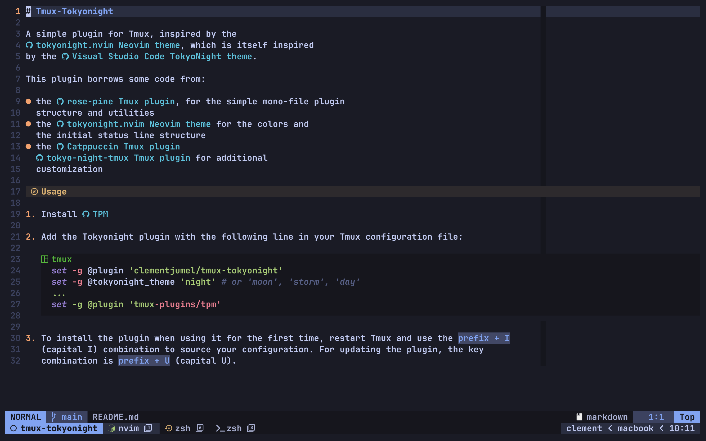
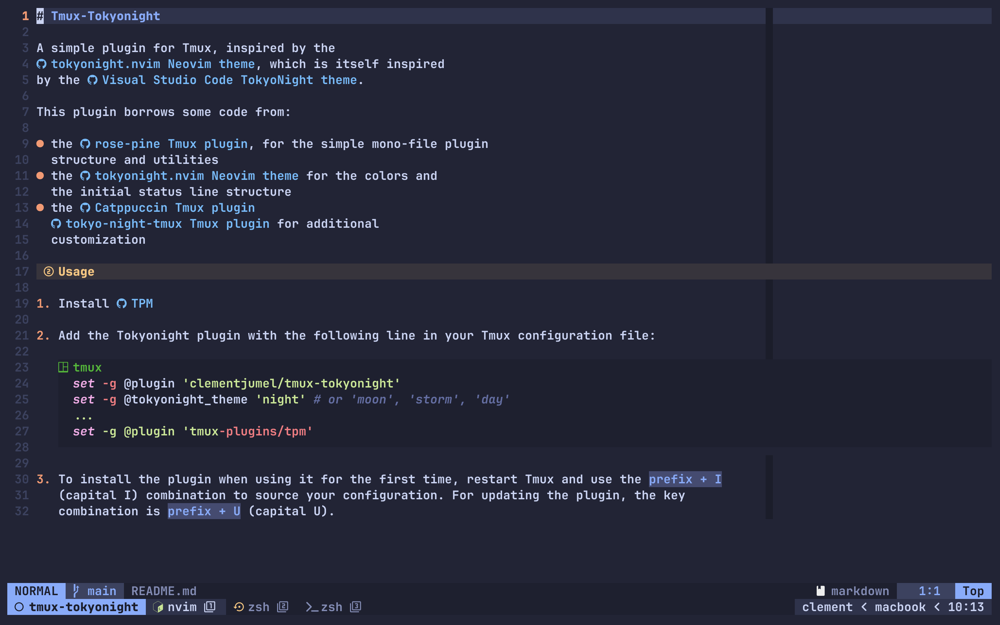
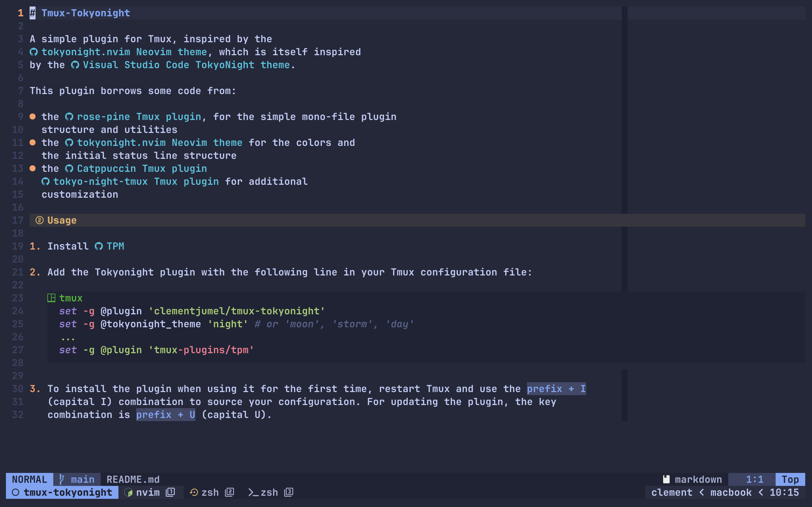
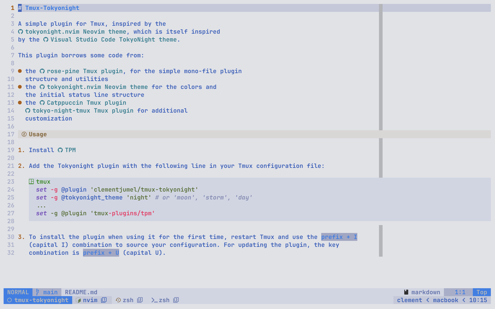

# tmux-tokyonight

A simple Tmux theme with [TokyoNight colors](https://github.com/enkia/tokyo-night-vscode-theme),
largely inspired by the
[tokyo-night-tmux Tmux theme](https://github.com/janoamaral/tokyo-night-tmux) and designed to work
well with the [tokyonight.nvim Neovim theme](https://github.com/folke/tokyonight.nvim).

I developped this plugin because, while I really liked the
[tokyo-night-tmux](https://github.com/janoamaral/tokyo-night-tmux) theme, I didn't need as much
features and wanted to have less requirements. Besides, I wanted to support all the styles
[tokyonight.nvim](https://github.com/folke/tokyonight.nvim) have and add a bit of customization.

## Usage

1. Install [TPM](https://github.com/tmux-plugins/tpm), the Tmux Plugin Manager

2. Add the tmux-tokyonight plugin in your Tmux configuration file, for instance with the following
   lines:

   ```tmux
     set -g @plugin 'clementjumel/tmux-tokyonight'
     set -g @tokyonight_theme 'night' # or 'moon', 'storm', 'day'
     ...
     set -g @plugin 'tmux-plugins/tpm'
   ```

3. When using the plugin for the first time, type `prefix + I` (capital I) from within a Tmux
   session, to install it. For updating the plugin at some point, the key combination is
   `prefix + U` (capital U).

## Screenshots

<details>
<summary>Night</summary>



</details>

<details>
<summary>Moon</summary>



</details>

<details>
<summary>Storm</summary>



</details>

<details>
<summary>Day</summary>



</details>

## Thanks to

- [tokyo-night-tmux](https://github.com/janoamaral/tokyo-night-tmux)
- [tokyonight.nvim](https://github.com/folke/tokyonight.nvim)
- [rose-pine/tmux](https://github.com/rose-pine/tmux), for the plugin structure
